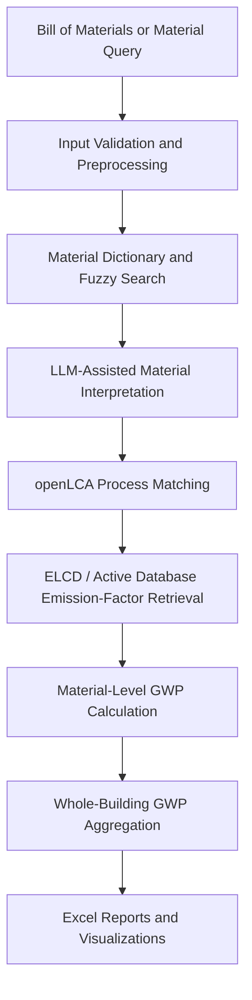

# AI-Enhanced Life Cycle Assessment

## An Integrated Framework for Automated Upfront Embodied Carbon Assessment of Building Materials

This repository contains the source code, sample data, and supporting
documentation for the research study:

> **AI-Enhanced Life Cycle Assessment: An Integrated Framework for Automated
> Upfront Embodied Carbon Assessment of Building Materials**

The proposed framework integrates a locally deployable large language model,
openLCA, environmental life-cycle inventory data—including the European
Reference Life Cycle Database (ELCD)—and a FastAPI-based interface. Together,
these components automate upfront embodied-carbon assessment for individual
building materials and whole-building Bills of Materials (BOMs).

The framework reduces the manual effort associated with interpreting material
descriptions, matching environmental processes, retrieving emission factors,
converting quantities, calculating embodied carbon, and preparing results for
review.

## Overview

Upfront Whole-building life cycle assessment typically requires practitioners to:

- interpret inconsistent material descriptions;
- normalize quantities and units;
- search environmental databases;
- select representative processes;
- document proxy assumptions;
- retrieve emission factors; and
- calculate and aggregate environmental impacts.

This framework coordinates those steps in a single workflow. Users can evaluate
one construction material through the browser/API or upload a complete BOM for
automated whole-building assessment.

## Assessment scope

The research workflow focuses on upfront embodied carbon within product-stage
life cycle modules **A1–A3**:

| Module | Product-stage activity |
| --- | --- |
| **A1** | Raw-material supply |
| **A2** | Transportation to manufacturing |
| **A3** | Material manufacturing |

Results are reported as Global Warming Potential (GWP). The API exposes
`kg_co2e_per_kg` only when the selected openLCA process has a recognized mass
reference unit. For processes referenced by volume, area, or item, the response
retains `gwp_per_reference_unit` and `reference_unit` and explains why a
per-kilogram value was not calculated. This prevents dimensionally invalid BOM
aggregation.

## Main features

- automated processing of BOM spreadsheets;
- single-material embodied-carbon estimation;
- material-name interpretation using a local large language model;
- material dictionary lookup and fuzzy matching against openLCA processes;
- automated openLCA IPC queries;
- ELCD-based emission-factor retrieval when ELCD is loaded in openLCA;
- deterministic and LLM-assisted unit conversion;
- material-level GWP calculation;
- whole-building A1–A3 embodied-carbon aggregation;
- material hotspot identification;
- Excel report generation;
- graphical material-contribution summaries; and
- transparent source and conversion metadata for every inventory item.

The environmental database used at runtime is the database currently open in
openLCA. Load the ELCD database to reproduce the ELCD-based research workflow,
or configure another compatible database for comparative studies.

## Source transparency

The research methodology groups inventory results into three interpretation
categories:

1. **Direct database match** — a representative process is found directly in
   the active environmental database.
2. **Documented database proxy** — a related database process or documented
   conversion assumption is used when an exact record is unavailable.
3. **LLM-supported estimate** — the local model supplies an estimate only when a
   usable database result is unavailable.

Application outputs preserve fields such as `source`, `conversion_source`,
`conversion_notes`, `process_name`, and `message`. These fields provide the
evidence needed to distinguish database-supported results, proxy assignments,
and knowledge-based estimates during analysis.

## Framework architecture



The Llama model is integrated directly into the application process; it is not
deployed as a separate HTTP service. Loading is lazy, so the FastAPI application
and GUI can start without Torch, Transformers, model files, Hugging Face access,
or a GPU. If an LLM fallback is requested on an unsupported device, the running
application remains available and reports:

```text
Llama is not available
```

## Project layout

```text
.
├── app
│   ├── controllers       # request and use-case controllers
│   ├── core              # lazy in-process Llama engine and exceptions
│   ├── models            # Pydantic and domain models
│   ├── routes            # FastAPI routers
│   ├── services          # openLCA, material, BOM, and unit workflows
│   ├── templates         # browser GUI
│   ├── utils             # XLSX, chart, JSON, and text helpers
│   ├── __init__.py       # application factory
│   └── config.py
├── tests
├── main.py
├── requirements.txt
└── requirements-llama.txt
```

## Run the application

From this directory:

```bash
python3 -m venv .venv
source .venv/bin/activate
pip install -r requirements.txt
python main.py
```

Open <http://127.0.0.1:8000/>. The `/upload_bom` URL serves the same interface,
and interactive API documentation is available at
<http://127.0.0.1:8000/docs>.

### openLCA configuration

Start openLCA, open the intended database, and enable its IPC server on port
`8080`. The endpoint can be changed with `OPENLCA_HOST` and `OPENLCA_PORT`.

Calculations have a configurable deadline
(`OPENLCA_CALCULATION_TIMEOUT_SECONDS`, 600 seconds by default), preventing a
stalled IPC job from blocking all later requests.

### Optional local Llama

On a machine with a supported NVIDIA CUDA or Apple MPS GPU:

```bash
pip install -r requirements-llama.txt
```

The default model is `meta-llama/Llama-3.1-8B-Instruct`. Accept its Hugging Face
license and authenticate where required, or set `LLAMA_MODEL_ID` to a local
path or another compatible model. The application does not fall back to CPU
inference.

Model loading occurs only when a calculation needs an LLM fallback. Missing
packages, unsupported hardware, authorization failures, loading errors, and
GPU out-of-memory conditions are converted to a visible unavailable message
instead of stopping the GUI.

### BOM upload safeguards

BOM uploads are streamed with a 25 MiB default limit. Expanded XLSX size, row,
cell, and Excel-column limits are also enforced. Override the raw upload limit
with `BOM_MAX_UPLOAD_BYTES`.

## Safety setting

The original prototype deleted matching product systems before recreating
them. This implementation safely reuses product systems by default. Enable
recreation only when it is explicitly required:

```bash
OPENLCA_RECREATE_PRODUCT_SYSTEMS=true python main.py
```

## Tests

```bash
python -m unittest discover -s tests -v
```
